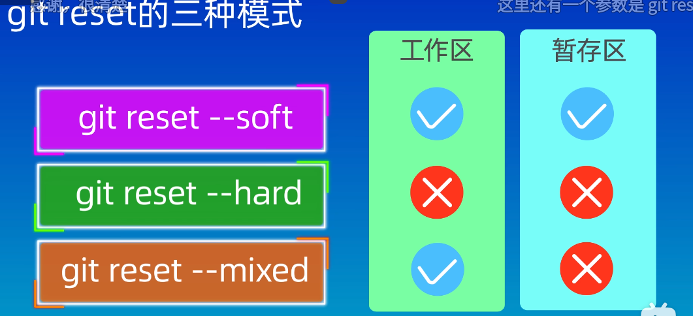
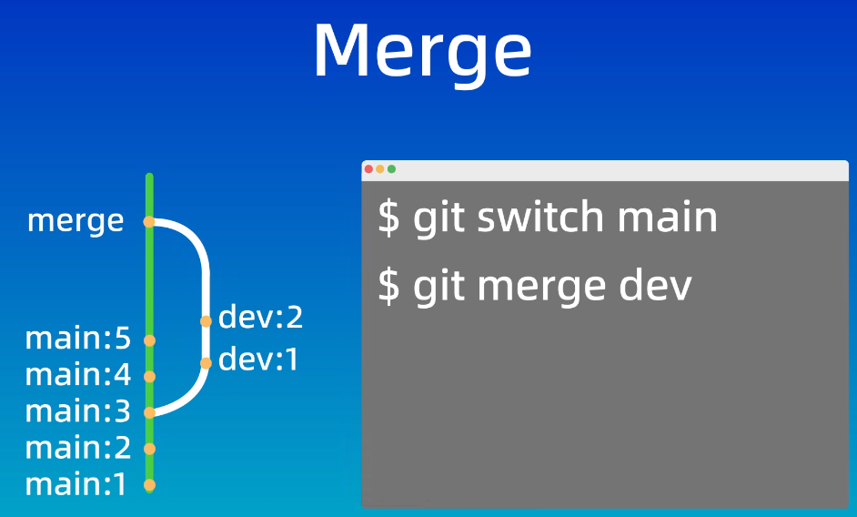
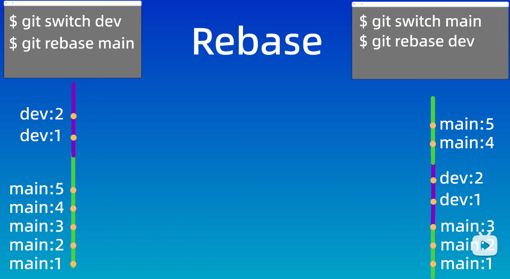
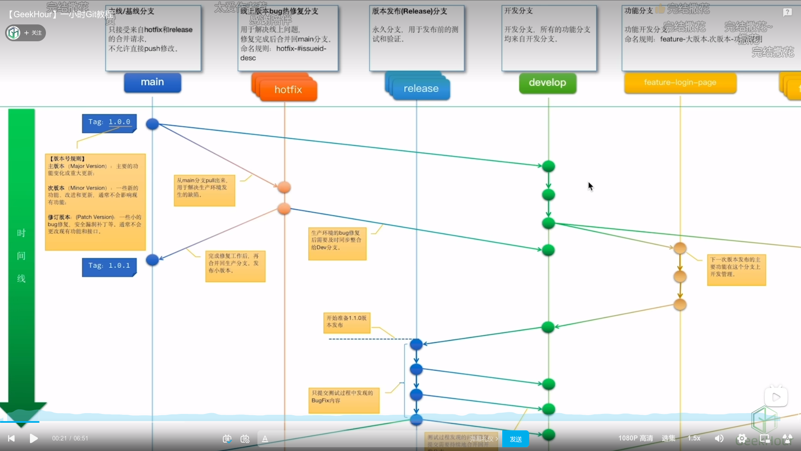
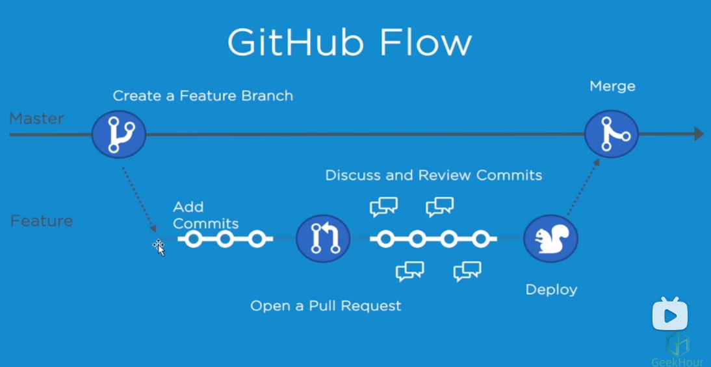

# git

## 安装

1. Ubuntu

```bash
   apt-get isntall git
   # 或者访问https://mirrors.edge.kernel.org/pub/software/scm/git/选择对应的压缩包，解压，设置环境变量 
```

2. Windows
   访问 [下载地址](https://git-scm.com/download/win) ，选择对应的版本，直接下载

## 结构

### repo

仓库，存放代码的地方

```bash
# 在当前目录下初始化一个仓库
git init
# 初始化一个命名仓库
git init my_project
# 克隆远程仓库到本地,使用仓库名作为目录
git clone https://github.com/gszw90/notes.git
# 克隆远程仓库到本地,自定义目录名
https://github.com/gszw90/notes.git new_name
```

### 本地管理

#### 工作区（.git）

> 也叫工作目录或者本地工作目录

#### 暂存区(.git/index)

> 也可以叫索引，用于保存即将提交到git仓库的修改内容

#### 本地仓库(.git/objects)

> 通过init或者clone创建的目录，包含完整的项目历史与元数据，是git存储代码与版本信息的主要位置

#### 状态

- **未追踪（untrack）:** 新创建的还未被git管理的文件
- **未修改（unmodified）：** 已被git管理，但是内容还未发生修改的文件
- **已修改（modified）：** 被git管理，已经修改，但是还未提交到暂存区的文件
- **已暂存（staged）：** 已修改，且已经提交到暂存取的文件

## 操作

### 查看

```bash
# 查看状态
git status
# 查看提交日志
git log
# 日志只显示id与提交信息
git log --oneline
```

### 配置文件

> 配置的级别有三种，system，global，local

**system:** 系统配置，对所有用户有效，配置文件在/etc/gitconfig下

**global:** 全局配置，对当前用户生效，配置文件在~/.gitconfig下

**local:** 本地设置，只对当前项目生效，配置文件在项目的.git下

#### 配置用户名与邮箱

```bash
git config --global user.name "zeng"
git config --global user.email "zeng@163.com"
# 记住账号与密码，不用每次都再输入一次
git config credential.helper store
# 查看配置
git config --global --list
```

### 提交

```bash
# 将文件提交到暂存区
git add filename
# 使用通配符添加某一类型的文件
git add *.txt
# 将所有发生修改的文件提交到暂存区
git add .
# 将暂存区的文件提交到本地仓库，对于不在暂存区内的文件，不会被提交
# 提交时需要填写提交信息
git commit -m "commit msg"
```

### 删除文件

```bash
# 删除工作区与暂存区内的文件
git rm filename
# 删除暂存区指定文件，但是工作区内文件还存在
git rm --cached filename
# 删除暂存区所有文件
git rm --cached -r .
```

### 版本回退

#### 模式

- **soft：** 保留暂存区与工作区的内容
- **hard：** 丢弃暂存区与工作区的内容
- **mixed：** 默认选项，保留工作区的内容，丢弃暂存区的内容



#### 命令

```bash
# 回退到指定版本
git reset --soft 5a4fb
# 回退到上一个版本，head表示当前分支版本
git reset --hard HEAD~1
git reset --hard HEAD^
# 回退到上上个版本
git reset --hard HEAD~2
git reset --hard HEAD^^
# 回退到上3个个版本
git reset --hard HEAD~3
```

### 差异查看

```bash
# 查看工作区与暂存区的差异
git diff
# 查看工作区与版本库的差异
git diff HEAD
# 查看暂存区与版本库的差异
git diff --cached
# 查看两个版本库之间的差异
git diff 5a4fb 5acfc
# 比较指定文件在不同版本间的差异
git diff 5a4fb 5acfc filename
# 查看当前版本与上一个版本见的差异
git diff head^ head
```

### Gitignore

#### 忽略原则

1. 系统或者程序自动生成的文件
2. 编译产生的中间文件与结果文件
3. 系统运行生成的日志、缓存、临时文件
4. 带有敏感信息的配置文件，证书文件

#### 匹配规则

1. 空行或者以#开头的行会被忽略，注释使用#来表示
2. 通配符规则：
   1. ？表示单个字符
   2. *表示任意个字符
   3. []表示匹配表中的单个字符
   4. **表示匹配任意的中间目录
   5. [0-9]表示匹配任意一个一位数
   6. [a-z]表示匹配任意一个小写字母
   7. !表示取反

```gitignore
# 具体文件或者目录
.env
runtime/
# 某类文件
*.log
# 保留z.log
!z.log
# 目录下的某类文件
./tmp/*.log
```

### 远程仓库关联

```bash
本地仓库关联远程空仓库
# 添加远程仓库
git remote add origin <远程仓库的URL>
# 查看仓库关联情况
git remote -v
# 推送信息到远程仓库
git push -u origin master
```

### 分支

#### 查看分支

```bash
# 查看本地所有分支
git branch
# 查看远程所有分支
git branch -r
```

#### 创建分支

```bash
# 创建一个新分支
git branch new_branch
# 创建并切换到新分支
git branch -b new_branch
```

#### 切换分支

> Checkout 也可以用来恢复文件，如果分支名与文件名一样，会执行恢复文件的操作，因此切换分支最好使用switch

```bash
git checkout new_branch
git switch new_branch
```

#### 分支合并

##### merge

**优点：** 不会改变原分支的提交历史，方便回溯与查看

**缺点：** 会产生额外的提价节点，分支图会比较复杂


```bash
# 将new_branch合并到当前分支中
git merge new_branch
```

##### Rebase

**优点：** 不会产生新的提交节点，形成线性历史，比较直观干净

**缺点：** 会改变提交历史，改变了当前分支branch out的节点。需要避免在共享分支上使用


```bash
# rebase可以在任意一个分支上执行
git rebase new_branch
```

#### 删除分支

```bash
# 删除本地分支
git branch -d new_branch
# 对于没有合并的分支是不能删除的，可以使用-D来强制删除
git branch -D new_branch
# 删除远程分支
git push origin --delete new_branch
```

## 工作流

### 版本号规则

**主版本：** 主要的功能变化或重大更新

**次版本：** 一些新的功能，改进或者更新，通常不会影响现有功能

**修订版本：** 一些小的bug修改，版本补丁等，通常不会更改现有的功能与接口

### gitflow



#### 主线分支（main）

包含项目最新的稳定版本代码，应该保证主线分支中的代码是随时可以发布的，生产环境中部署的就是主线分支的代码。

主线分支的代码是不允许直接修改的，只接受hotfix与release分支的合并修改，每次合并建议生成一个新的版本号，方便追踪与回溯。

tag命名规范:v1.0.1

#### 热修复分支（hotfix）

包含某个问题修复的源码，用于修复线上的问题。一般修复分支是从main分支上分离出来的，开发完成后会合并到main分支与develop分支中，问题修复完成后一般会把这个hotfix分支删除掉，同时会更新main分支的小版本号。

命名规范：hotfix-#issueid-desc

#### 开发分支（develop）

是从main分支中分离出来的，包含最新的开发版本代码，用于开发与测试，它是项目的核心分支

#### 功能分支（feature）

包含某项新功能的代码，用于开发新功能，是从develop分支分离出来的，当功能稳定后，会被合并到develop分支中。

命名规范：feature-login-page

#### 预发布分支（release）

包含有最新预发布代码，用于发布前的测试与验证，一般是从develop分支中分离出来的，当它的代码稳定后会被合并到develop与main分支中。

### githubflow


有一个长期存在的主分支，主分支的代码可以直接部署到生产环境中。一般会设置分支保护，禁止团队成员直接修改主分支，团队成员可以从主分支中分离出自己的分支来开发，开发文成后发起一个pr（pull
request），团队成员对代码进行review，如果代码没有问题就可以将这个pr发布和合并到主分支，整个流程就完成了。

## 操作修复

1. 使用reset --hard 误删修改内容

```bash
# 查看之前的操作日志id
git reflog
# 回退到对应的版本
git reset --hard f23b2 
```

2. 如果你在 Git 中已经跟踪了一个文件，但之后将该文件添加到了 .gitignore 文件中，Git 并不会自动停止跟踪该文件。

```bash
# 在索引中删除该文件，后续修改就不会提交版本管理中了
git rm --cached filename 
```