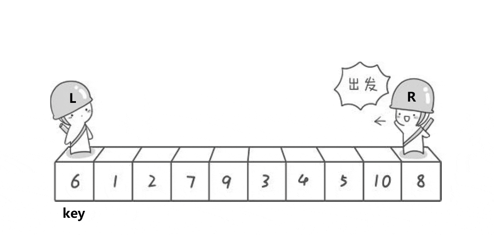
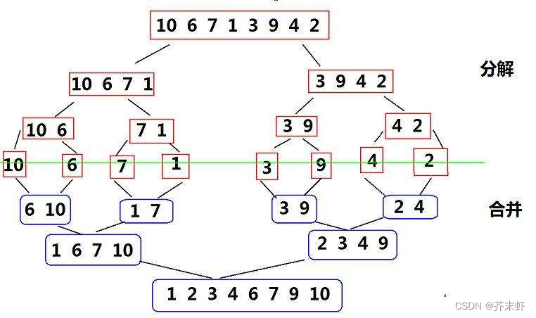

# 常见排序算法
## 插入排序
### 直接插入排序
> 原理：将目标值插入到一个已经排好序的序列中


```go
func insertSort(nums []int) []int {
	l := len(nums)
	if l < 2 {
		return nums
	}
	for i := 1; i < l; i++ {
		// 上一个数位置
		preIndex := i - 1
		//当前i位置的值
		val := nums[i]
		for preIndex >= 0 {
			// 上一个位置的数比当前位置的小，说明已经是有序的
			if nums[preIndex] <= val {
				break
			}
			// 上一个位置的数比当前位置的数大，就把上一个位置的数向后移动一位，把当前位置指针向前移动一位
			nums[preIndex+1] = nums[preIndex]
			nums[preIndex] = val
			preIndex--
		}
	}

	return nums
}
```

### 希尔排序
> 希尔排序是对直接插入排序的优化，以希尔排序先通过多次分组预排序使序列接近有序，最后再进行直接插入排序≈O(N)，以此来提高效率

**分组**：
1. 通过增量gap对序列进行分组控制，gap是组内元素之间的间距，同时也是组数。
2. gap初始化为n; 每次分组预排gap = gap/3+1；除3是进过多次试验得出的最佳缩小系数，加1是为了避免跳过最后一次直接插入排序。
3. 直到gap==1进行最后一次直接插入排序使序列顺序有序


```go
func shellSort(nums []int) []int {
    l := len(nums)
    if l < 2 {
        return nums
    }
    // 间隔长度
    gap := l
    for gap > 1 {
        // 计算生成新的间隔
        gap = gap/3 + 1
        for i := gap; i < l; i++ {
            // 记录当前值
            val := nums[i]
            // 当前值的位置
            j := i
            // 对i前面的元素根据gap来进行插入排序，
            for j >= gap && nums[j-gap] > val {
                nums[j], nums[j-gap] = nums[j-gap], nums[j]
                j -= gap
            }
        }
    }
    return nums
}
```

## 选择排序
### 选择排序
> 选择数组的左右两端，遍历找出区间内的最大值与最小值，把最大值放在右边，最小值放在左边

```go
func selectSort(nums []int) []int {
	l := len(nums)
	if l < 2 {
		return nums
	}
	left, right := 0, l-1
	for left <= right {
		// 记录区间内最小与最大数的位置
		minIndex := left
		maxIndex := right
		for i := left; i <= right; i++ {
			// 最小数位置
			if nums[i] < nums[minIndex] {
				minIndex = i
			}
			// 最大数位置
			if nums[i] > nums[maxIndex] {
				maxIndex = i
			}
		}
		// 如果最大位置在left处，当把最小处的元素交换到left处后，
		// left处原来最大的元素就被交换到了minxIndex处
		if maxIndex == left {
			maxIndex = minIndex
		}

		// 将最小元素移动到左边
		if left != minIndex {
			nums[left], nums[minIndex] = nums[minIndex], nums[left]
		}
		// 将最大元素移动到右边
		if right != maxIndex {
			nums[right], nums[maxIndex] = nums[maxIndex], nums[right]
		}
		// 缩小范围
		left++
		right--
	}

	return nums
}
```
### 堆排序
> 在堆排序中，我们通常使用二叉堆，这是一种特殊的完全二叉树，满足堆的性质：父节点的值总是大于或等于（最大堆）或小于或等于（最小堆）其子节点的值。

```go
func heapSort(nums []int) []int {
	l := len(nums)
	if l < 2 {
		return nums
	}
	// 构建最大堆
	buildMaxHeap(nums)
	// 从堆顶取出最大的元素，堆顶元素放到最后，然后重新堆化
	for i := l - 1; i >= 0; i-- {
		nums[i], nums[0] = nums[0], nums[i]
		heapify(nums, i, 0)
	}

	return nums
}

// 构建最大堆
func buildMaxHeap(nums []int) {
	l := len(nums)
	// 从最后一个非叶子节点开始，倒序遍历
	for i := l/2 - 1; i >= 0; i-- {
		heapify(nums, l, i)
	}
}

// 堆化
func heapify(nums []int, heapSize int, index int) {
	// 最大元素位置
	largest := index
	// 左子节点
	left := 2*index + 1
	// 右子节点
	right := 2*index + 2
	// 左节点元素大于最大元素
	if left < heapSize && nums[largest] < nums[left] {
		largest = left
	}
	// 右节点元素大于最大元素
	if right < heapSize && nums[largest] < nums[right] {
		largest = right
	}
	// 递归
	if largest != index {
		// 交换最大元素和当前元素
		nums[index], nums[largest] = nums[largest], nums[index]
		// 递归处理受影响的子树
		heapify(nums, heapSize, largest)
	}
}
```
## 交换排序
### 冒泡排序
> 原理：通过两两比较，将数组分为两半，然后两两比较，将两半合并，直到只有一个元素，然后两两合并，直到合并成一个有序数组


```go
package sort_algorithm

func BubbleSort(nums []int) []int {
	l := len(nums)
	if l < 2 {
		return nums
	}
	for i := 0; i < l; i++ {
		for j := i + 1; j < l; j++ {
			if nums[i] > nums[j] {
				nums[i], nums[j] = nums[j], nums[i]
			}
		}
	}

	return nums
}

```
### 快速排序
> 任取待排序元素序列中的某元素作为基准值，按照该排序码将待排序集合分割成两子序列，左子序列中所有元素均小于基准值，右子序列中所有元素均大于基准值，然后对左右子序列重复该过程，直到所有元素都排列在相应位置上为止。
>

```go
package sort_algorithm

func QuickSort(nums []int, low, high int) []int {
	l := len(nums)
	if l <= 1 {
		return nums
	}
	if low < high {
		// 获取基准元素的位置
		p := partition(nums, low, high)
		// 处理基准元素左右两侧的元素
		QuickSort(nums, low, p-1)
		QuickSort(nums, p+1, high)
	}
	return nums
}

// 分区,获取基准元素的位置
func partition(nums []int, low, high int) int {
	// 设置基准
	pivot := nums[low]
	// 小于基准元素的索引
	index := low
	for i := low + 1; i <= high; i++ {
		// 如果当前元素小于基准元素，则交换,基准元素索引后移一位
		if nums[i] <= pivot {
			index++
			nums[index], nums[i] = nums[i], nums[index]

		}
	}
	// 将基准元素交换到对应位置
	nums[index], nums[low] = nums[low], nums[index]
	return index
}
```
## 归并排序
### 归并排序
> 将一个数组分成两半，对每半递归地应用归并排序，然后将两个已排序的半部分合并成一个有序的数组。

```go
package sort_algorithm

func MergeSort(nums []int) []int {
	l := len(nums)
	if l < 2 {
		return nums
	}
	mid := l / 2
	left := MergeSort(nums[:mid])
	right := MergeSort(nums[mid:])

	return doMerge(left, right)
}

// 合并
func doMerge(left, right []int) []int {
	results := make([]int, 0, len(left)+len(right))
	// 记录左右数组的索引
	leftIndex, rightIndex := 0, 0
	leftLength, rightLength := len(left), len(right)
	// 左右数组都有数据时
	for leftIndex < leftLength && rightIndex < rightLength {
		// 左边数组的值小于右边数组的值，则将左边数组的值添加到结果数组中，并将左边数组的索引加1
		if left[leftIndex] < right[rightIndex] {
			results = append(results, left[leftIndex])
			leftIndex++
		} else {
			results = append(results, right[rightIndex])
			rightIndex++
		}
	}
	// 如果左边数组还有数据，则将左边数组的值添加到结果数组中
	if leftIndex < leftLength {
		results = append(results, left[leftIndex:]...)
	}
	// 如果右边数组还有数据，则将右边数组的值添加到结果数组中
	if rightIndex < rightLength {
		results = append(results, right[rightIndex:]...)
	}

	return results
}

```